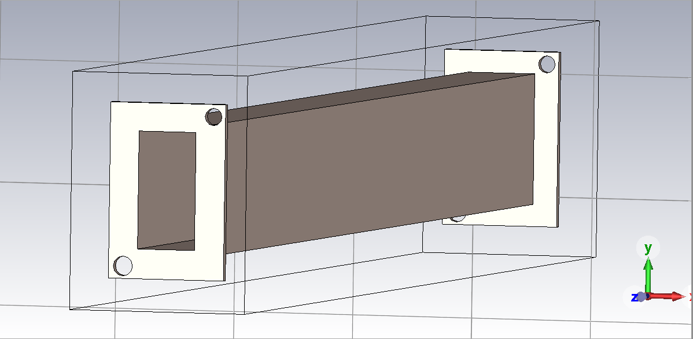
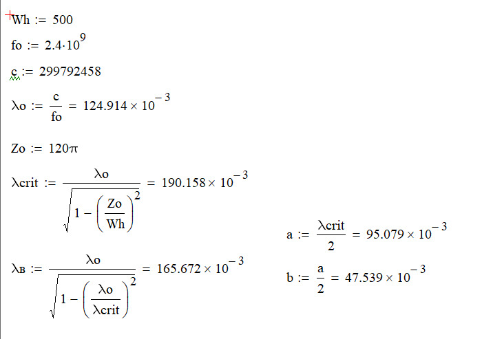

  <a href="README.md">Русский</a> | <b>English</b> | <a href="README.de.md">Deutsch</a>

# Design and 3D Simulation of a Rectangular Waveguide (2.4 GHz)

This project covers the analytical calculation of geometric dimensions and the electromagnetic 3D simulation of a rectangular waveguide operating at a center frequency of 2.4 GHz (fundamental $TE_{10}$ mode).

## Key Parameters

| Parameter | Symbol | Value |
| :--- | :--- | :--- |
| **Operating Frequency** | $f_0$ | 2.4 GHz |
| **Broad Wall Width** | $a$ | 95.08 mm |
| **Narrow Wall Width** | $b$ | 47.54 mm |
| **Cutoff Wavelength** | $\lambda_{crit}$ | 190.16 mm |
| **Guide Wavelength** | $\lambda_g$ | 165.67 mm |
| **VSWR at $f_0$** | $VSWR$ | 1.215 |

## Simulation Results (CST Studio Suite)

### 3D Model of the Rectangular Waveguide (Material: Aluminum)

### Voltage Standing Wave Ratio (VSWR) Plot

### Calculation and Simulation Summary

At the frequency $f = 2.4015 \text{ GHz}$, the simulated VSWR value is **1.215**.

## License

Copyright (c) 2026 Ilya Kornilov

This source document describes Open Hardware and is licensed under the CERN-OHL-P v2.
You may redistribute and modify this source document and make products using it
under the terms of the CERN-OHL-P v2 (https://cern.ch/cern-ohl).

This source document is distributed WITHOUT ANY EXPRESS OR IMPLIED WARRANTY,
INCLUDING OF MERCHANTABILITY, SATISFACTORY QUALITY OR FITNESS FOR A PARTICULAR PURPOSE.
Please see the CERN-OHL-P v2 for applicable conditions.
