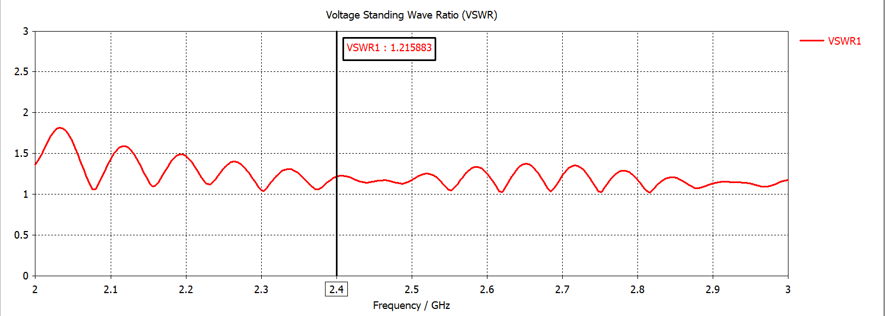

# Расчет и 3D-моделирование прямоугольного волновода (2.4 ГГц)

Проект расчета геометрии и электродинамического моделирования прямоугольного волновода на рабочей частоте 2.4 ГГц (мода $H_{10}$).

## Основные параметры

| Параметр | Обозначение | Значение |
| :--- | :--- | :--- |
| **Рабочая частота** | $f_0$ | 2.4 ГГц |
| **Ширина широкой стенки** | $a$ | 95.08 мм |
| **Ширина узкой стенки** | $b$ | 47.54 мм |
| **Критическая длина волны** | $\lambda_{crit}$ | 190.16 мм |
| **Длина волны в волноводе** | $\lambda_g$ | 165.67 мм |
| **КСВН (VSWR) на $f_0$** | $VSWR$ | 1.22 |

## Результаты моделирования (CST Studio Suite)

### 3D моделька

### График КСВН

### Расчет

На частоте $f = 2.4015 \text{ ГГц}$ значение КСВН составляет **1.219**.
